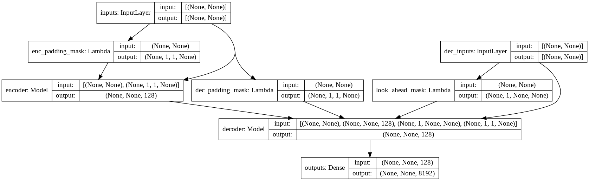

## Transformer Chatbot with TensorFlow 2
Build an end-to-end chatbot with [Transformer](https://arxiv.org/abs/1706.03762) in TensorFlow 2.
Checkout my tutorial on [blog.tensorflow.org](https://blog.tensorflow.org/2019/05/transformer-chatbot-tutorial-with-tensorflow-2.html).

### Updates
- 16 June 2022:
  - Update `setup.sh` script to install Apple Silicon version of TensorFlow 2.9 (only use this if you're feeling adventurous).
  - Updated the two custom layers, `PositionalEncoding` and `MultiHeadAttentionLayer`, to allow model saving via `model.save()` or `tf.keras.models.save_model()`.
  - `train.py` showcase how to call `model.save()` and `tf.keras.models.load_model()`.
- 8 Dec 2020: Updated support to TensorFlow 2.3.1 and TensorFlow Datasets 4.1.0
- 18 Jan 2020: Added [notebook](tf2_tpu_transformer_chatbot.ipynb) with  Google Colab TPU support in TensorFlow 2.1.

### Packages
- TensorFlow 2.9.1
- [TensorFlow Datasets](https://www.tensorflow.org/datasets)

### Setup
- create new anaconda environment and initialize environment `chatbot`
    ```
    conda create -n chatbot python=3.8
    conda activate chatbot
    ```
- run installation script
    ```
    sh setup.sh
    ```
- Note: the script would install CUDA and cuDNN via conda if installing on a Linux system, or `tensorflow-metal` for devices with Apple Silicon (Note that there are tons of bugs with TensorFlow on Apple Silicon GPU, e.g. [Adam optimizer does not work](https://developer.apple.com/forums/thread/691917)).

### Dataset
- We will use the conversations in movies and TV shows provided by [Cornell Movie-Dialogs Corpus](https://www.cs.cornell.edu/~cristian/Cornell_Movie-Dialogs_Corpus.html), which contains more than 220 thousands conversational exchanges between more than 10k pairs of movie characters, as our dataset.
- We pre-process our dataset in the following order:
	- Extract `max_samples` conversation pairs into list of `questions` and `answers`.
	- Pre-process each sentence by removing special characters in each sentence.
	- Build tokenizer (map text to ID and ID to text) using [TensorFlow Datasets SubwordTextEncoder](https://www.tensorflow.org/datasets/api_docs/python/tfds/features/text/SubwordTextEncoder).
	- Tokenize each sentence and add `start_token` and `end_token` to indicate the start and end of each sentence.
	- Filter out sentence that has more than `max_length` tokens.
	- Pad tokenized sentences to `max_length`
- Check [dataset.py](transformer/dataset.py) implementation.

### Model

- check [model.py](transformer/model.py) for the implementation of Multi-Headed Attention, Positional Encoding and Transformer.

### Run
- check all available flags and hyper-parameters `python main.py --help`
```
python train.py --output_dir runs/save_model --batch_size 256 --epochs 50 --max_samples 50000
```
- the final trained model will be saved to `runs/save_model`.

### Samples
```
input:		where have you been?
output:		i m not talking about that .

input:		it's a trap!
output:		no , it s not .
```
